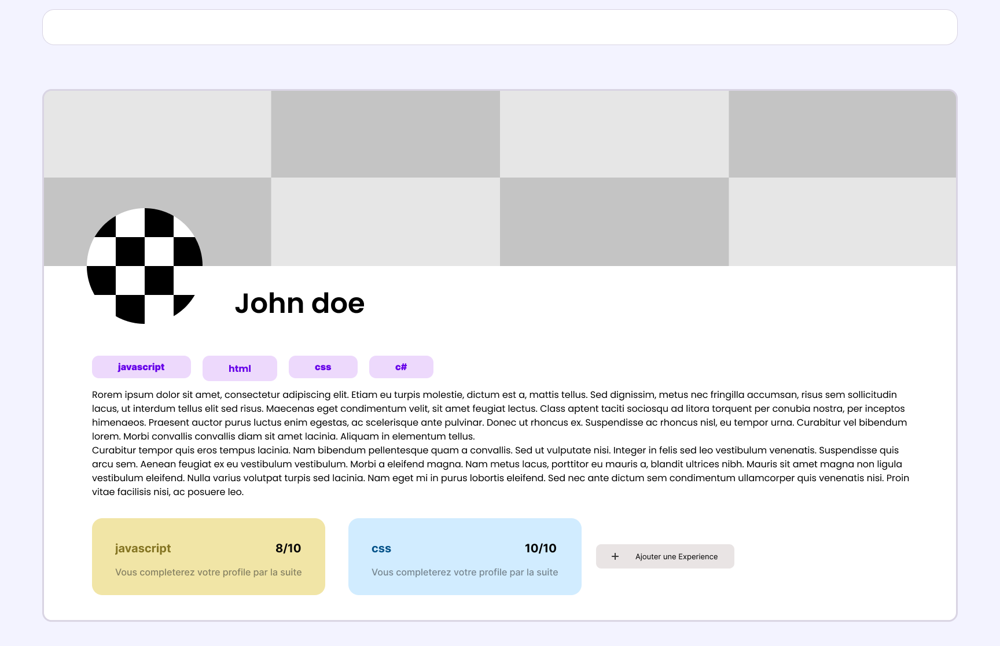
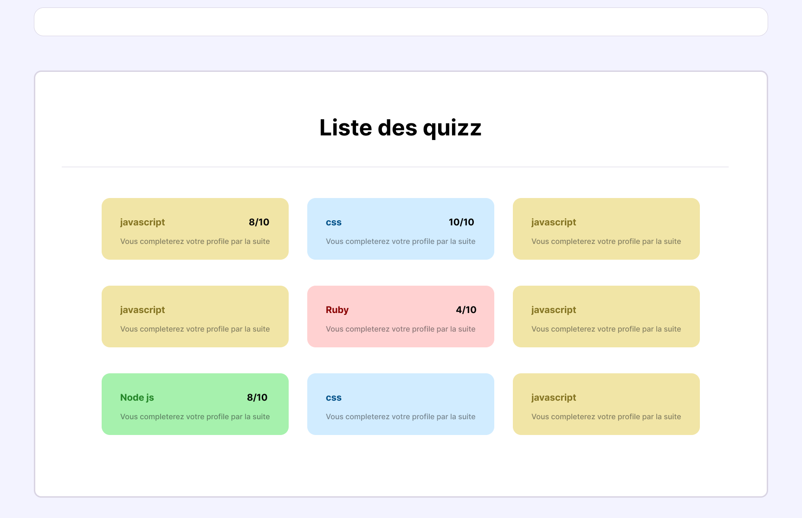

# Cahier des Charges Techniques

## 1. Introduction

### 1.1 Objectif du Document

Ce document vise à définir de manière exhaustive les spécifications techniques du projet. Il sert de référence pour toutes les parties prenantes impliquées dans le développement, la mise en œuvre et la maintenance du projet.

### 1.2 Portée du Projet

ProDev/DevHive est un projet permettant aux développeurs junior de tester leurs connaissances sur différents langages de programmation et plus globalement sur leur connaissances en développement.
Le but est de rassembler et fédérer une communauté autour du projet afin que chacun puisse se tester, s'amuser et augmenter ses compétences et ses capacités.
Notre projet cible donc les jeunes développeurs, à terme nous souhaitons également intégrer des fonctionnalités pour mettre en relation jeunes étudiants et entreprises.

## 2. Spécifications Techniques

### 2.1 Architecture Système

- Architecture Globale : Utilisation d'un mono repository

#### Schéma d'architecture

#### Diagramme de base de données

### 2.2 Choix Technologiques

- Langages de Programmation : JS.
- Frameworks et Bibliothèques : Stack MERN, ReactJS, NodeJS, ExpressJS.
- Base de Données : NOSQL, MongoDB, Mongoose.
- Outils de Développement : VsCode, Git.

| Technologie | Avantages                                                                                                                                    | Inconvénients                                                    |
| ----------- | -------------------------------------------------------------------------------------------------------------------------------------------- | ---------------------------------------------------------------- |
| React       | Connue par le Groupe, Grande communauté et ressources dispos en ligne, Fragmentation de l'application, recherché dans le monde professionel |                                                                  |
| NodeJS      | Coté serveur géré avec du javascript, Faciliter de déploiement avec render, grande communauté                                                |                                                                  |
| ExpressJs   | Création d'un serveur rapidement et facilement                                                                                               |                                                                  |
| CssModules  | Evite les conflits de css, libérté de customisation importantes                                                                              | Répétitions de codes, écriture chronophage car cela reste du css |

Vous pouvez également donner une note sur 5.

| Critère           | React | NodeJS | Express |
| ----------------- | ----- | ------ | ------- |
| **Documentation** | 5/5   | 3/5    | 4/5     |
| **Popularité**    | 5/5   | 4/5    | 4/5     |
| **Performance**   | 4/5   | 4/5    | 4/5     |
| **Connaissance**  | 3/5   | 1/5    | 1/5     |
| **Total**         | 17/20 | 12/20  | 13/20   |

### 2.3 Interfaces Système

- APIs Externes : Utilisation de l'API d'OpenAI afin de générer des quizz.
- Intégration de Systèmes : Appel vers l'API depuis notre Front-End.

## 3. Développement

### 3.1 Gestion de Version

- Outils de Gestion de Version : Git, pas de Git Master chacun fait sa review de code

### 3.2 Normes de Codage

- Style de Codage : ES6, camel case.

## 4. Déploiement et Maintenance

### 4.1 Environnements

- Hébérgement: Hébéergement du back avec Render, Hébergement du Front avec Vercel.

## 5. Documentation

### 5.1 Documentation Technique

- Code Source : Commentaires, documentation intégrée.
- Documentation Externe : Outils et format (ex : Wiki, ReadTheDocs).

### 5.2 Documentation Utilisateur

- Manuels Utilisateur : Guides, FAQ, etc.
- Formation : Matériaux et sessions de formation prévus.

### 6. Features

##### Liste des Fonctionnalités du Projet

1. **BDD** : Créer les utilisateurs en BDD.
2. **Auth** : Implémenter JWT.
3. **Routes** : Route et controller de Login / Signup.
4. **Frontend-Auth** : Créer frontend Login / Signup.
5. **Frontend Profile**: Créer Profil utilisateur.
6. **Frontend Quizz**: Créer quizz
7. **Email** : Envoie d'email de réinitialisation.

##### Temps Estimé par Tâche

- **Tâche BDD** : 1 jour.
- **Tâche Auth** : 3 jours.
- **Tâche Routes** : 3 jours.
- **Tâche Frontend-Auth** : 1 jour.
- **Tâche Frontend Profile** : 1 jour.
- **Frontend Quizz**: 3 jours.
- **Tâche Email** : 1 jour.

##### Scope Défini

- **Phase 1** : Implémentation des fonctionnalités BDD et Auth.
- **Phase 2** : Développement des fonctionnalités Routes et Frontend.
- **Phase 3** : Développement de la fonctionnalités envoie d'email de réinitialisation.
- **Phase 4** : Développement création profil utilisateur Back et Front.
- **Phase 5** : Implémentation API OpenAI et création des quizz Frontend
- **Phase 6** : Test de nos fonctionnalités.

##### Priorité Définie

1. **Haute** : BDD, Routes
2. **Moyenne** : Auth, Frontend, Quizz
3. **Basse** : Profil, Email

##### Date de Fin

- **Date Prévue** : 29/11/23

## 7. Annexes

### 7.1 Maquettes

## 8. Conclusion

### - Nos fonctionnalités :

    - Inscription.
    - Connexion.
    - Réinitialisation mot de passe.
    - Création d'un profil.
    - Création de quizz à partir de OpenAI.
    - Affichage résultat et création de badges.

### - A venir :

    - Envoie d'un certificat par mail lors d'un quizz réussi.
    - Création de profil entreprise.
    - Possibilité de mentorat (Prise de contact entre étudiant).
